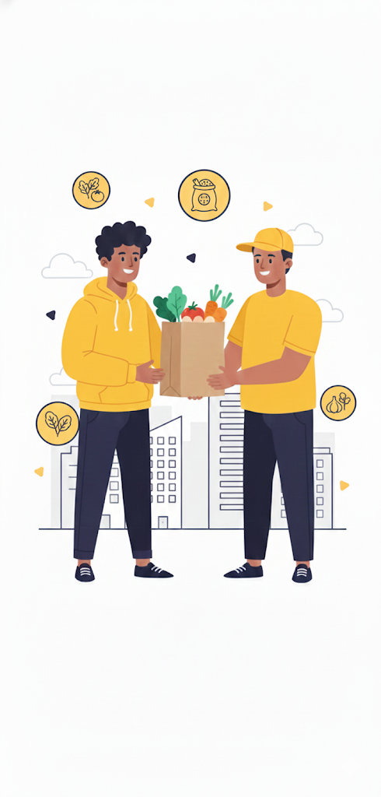
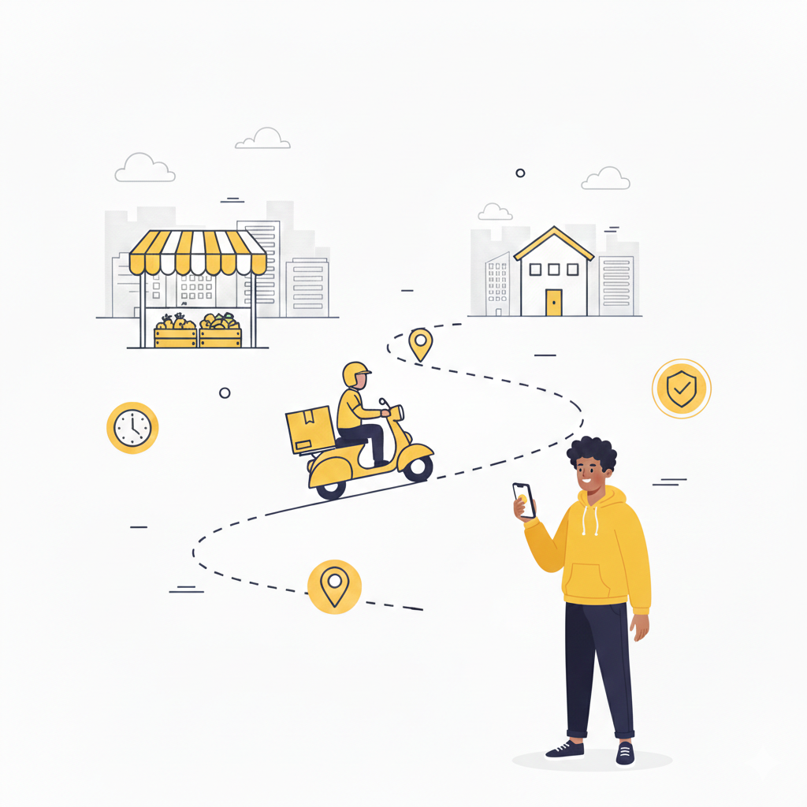

# Hustlers 🥬🍅🥩

**Hustlers** is a next-generation digital marketplace built with Flutter, designed to bridge the gap between local market vendors and urban consumers. Unlike standard food delivery apps, Hustlers specializes in the sourcing of **raw cooking ingredients** directly from verified local markets, farms, and small-scale suppliers.

<p align="center">
  
  
  
</p>

## 🚀 The Problem
Many households struggle with the time-consuming stress of visiting physical markets and the uncertainty of ingredient quality. Meanwhile, local vendors lack the tools to reach customers beyond their physical stalls. Hustlers provides a seamless, trust-based platform to solve both ends of the spectrum.

## ✨ Key Features
- **Verified Seller System:** Trust-based onboarding with identity and location verification.
- **Dynamic Marketplace:** Browse ingredients by category (Grains, Vegetables, Meat, etc.) with real-time updates.
- **Order Management:** Real-time tracking of orders from the market to your doorstep.
- **Messaging:** In-app communication between buyers and sellers for specialized requests.
- **Secure Payments:** Integrated payment gateways for safe and easy transactions.
- **Customized Experience:** Preference-based onboarding to tailor the marketplace to your cooking style.

## 🛠 Technology Stack
- **Framework:** [Flutter](https://flutter.dev/) (Cross-platform Android & iOS)
- **State Management:** [Riverpod](https://riverpod.dev/)
- **Navigation:** [Go Router](https://pub.dev/packages/go_router)
- **Networking:** [Dio](https://pub.dev/packages/dio)
- **Backend:** [Firebase](https://firebase.google.com/) 
- **Animations:** [Flutter Animate](https://pub.dev/packages/flutter_animate)
- **UI Utilities:** ScreenUtil for responsiveness, SVG for icons.

## 📁 Project Structure
The project follows a feature-first clean architecture:
- `lib/core`: Shared services, themes, and utility functions.
- `lib/features`: Distinct modules (Auth, Marketplace, Orders, Messaging, etc.).
- `lib/app.dart`: Main application configuration and routing.

## 🏃 Getting Started
### Prerequisites
- Flutter SDK (latest stable version)
- Android Studio / VS Code
- A running emulator or physical device

### Installation
1. Clone the repository:
   ```bash
   git clone https://github.com/Malcolm-xXx/Hustlers.git
   ```
2. Navigate to the project directory:
   ```bash
   cd Hustlers
   ```
3. Install dependencies:
   ```bash
   flutter pub get
   ```
4. Run the app:
   ```bash
   flutter run
   ```

---
*Created with ❤️ to empower everyday hustlers and modernize local food commerce.*
